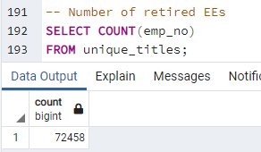
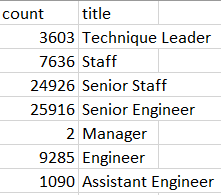

# Pewlett-Hackard-Analysis
## Overview
The purpose of this project is to help the manager of Pewlett-Hackard (PH) prepare for a mass retirement of employees or "silver tsunami." Per PH requirements set in 2022, retirement is mandatory for employees born between 1952 and 1955 and/or hired between 1985 and 1988. Additionally, PH plans to use this analysis to determine how the mentorship program will be developed to accomodate the retirees. Per PH requirements, employees eligible for mentorship must be born during 1965. To gather that information structured query language (SQL) was used to identify, analyze, and report PH employee data. See below for project details including, SQL and tables.
## Results
Some of the observations from the analysis include:
* The total number of retiring employees is 72,458

* The top job titles of the retirees are: Senior Engineer, Senior Staff, and Engineer

* The total employees eligible for mentorship is 1,549.
* The top job titles of the employees eligible for mentorship are: Senior Staff, Engineer, and Staff

## Summary
- How many roles will need to be filled as the "silver tsunami" begins to make an impact?

The number of roles needed to be filled is 72,458. However, an approach that could be explored is onboarding employees to fill the outstanding roles over a course of 3 years. Since the age gap is a three year period (i.e., 1952 to 1955) this could allow more flexibility with mentoring more employees. In addition, there could be more experienced employees that were not born prior to 1955 but have more than 15 years experience. Could incoroprate a query that gathers the total number of employees that have more than 15 years experience by using the 'from_date'column to represent the hire date.

- Are there enough qualified, retirement-ready employees in the departments to mentor the next generation of Pewlett Hackard employees?
Based on the total retirees, there are more than enough employees that could be mentors for future employees. 

